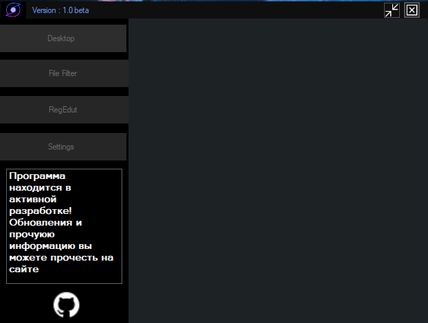

# A program that will simplify the life of a perfectionist

The File Changer program has many different functions!
You can :
- Automatic file filtering
- Desktop File View
- Regestry
    - Diiferent Windows tweaks
    - Optimization
- Clean Regestry

### Last Update: 
> Regestry edit ( Hide all  desktop icons )
>
> Fix File Filter 
> New Design 
> #### New Desing
>
> - Added tabs
> - New future - Program description
>
>  *Everything* is going according to **plan**.
 
